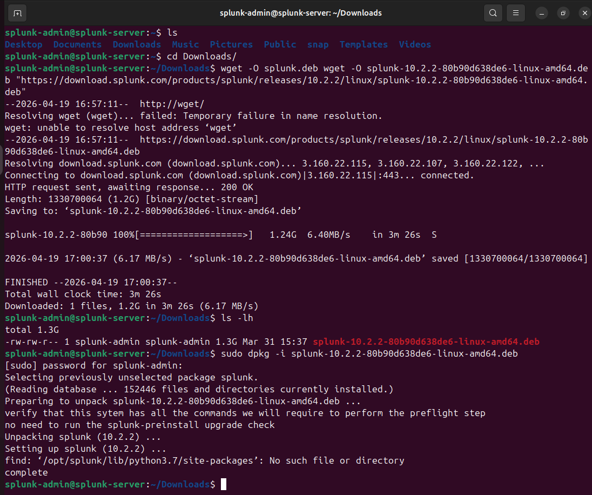
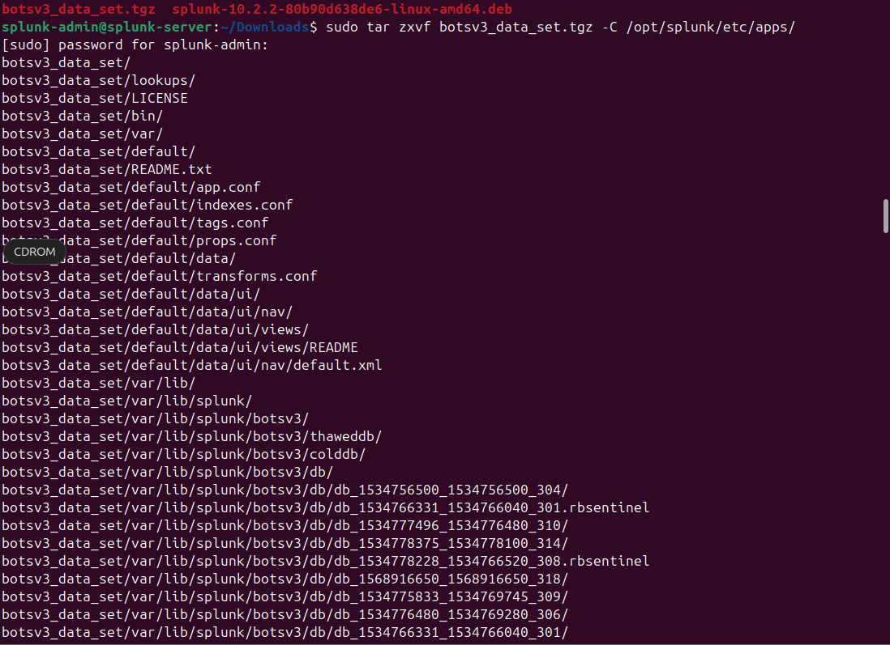
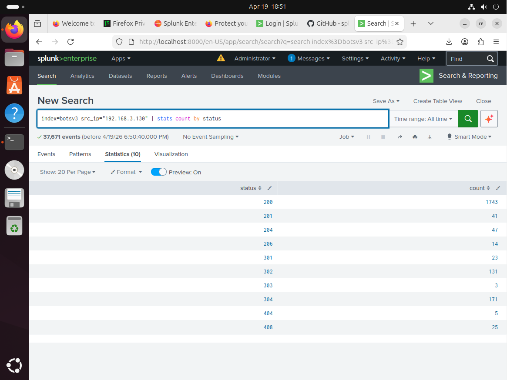
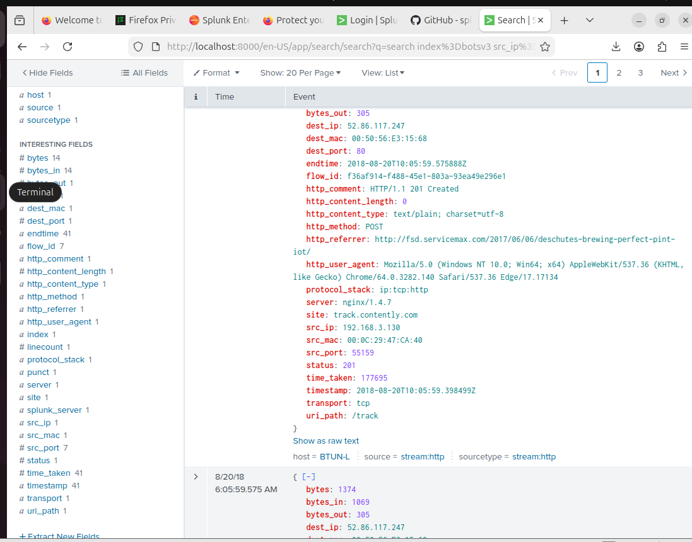
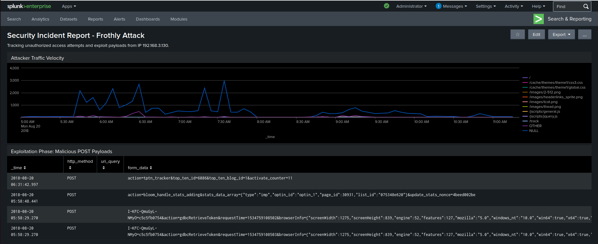

# 🛡️ Splunk SOC Analyst Lab: BOTS v3 Incident Investigation

## 🚀 Project Overview
This project demonstrates an end-to-end security investigation within a self-hosted SIEM environment. I deployed **Splunk Enterprise** on an **Ubuntu 24.04 LTS** server to ingest, analyze, and visualize a simulated Advanced Persistent Threat (APT) attack from the **Boss of the SOC (BOTS) v3** dataset. 

The investigation follows the **NIST Incident Response Lifecycle**, moving from detection and analysis to forensic documentation.

---

## 🏗️ Phase 1: Infrastructure & Data Engineering
To simulate an enterprise SOC environment, I provisioned a Splunk SIEM on Ubuntu and manually injested over 300,000 events from the BOTS v3 dataset to practice real-world threat hunting.

* **SIEM Deployment:** Installed Splunk Enterprise via the command line on Ubuntu 24.04.
* **Data Lifecycle:** Ingected 300,000+ events from the BOTS v3 dataset, configuring indexes and sourcetypes for forensic accuracy.

| System Build | Data Ingestion |
| :--- | :--- |
|  |  |

---

## 🕵️ Phase 2: Tactical Threat Hunting
Using **Search Processing Language (SPL)**, I performed a multi-stage hunt to isolate the threat actor.

### 1. Identifying "Top Talkers"
By looking at the HTTP traffic, I identified **192.168.3.130** as the main suspect because it had an unusually high volume of POST requests.

### 2. Mapping the Attack Surface
Analysis of HTTP status codes (specifically `201 Created`) confirmed that the attacker successfully uploaded or created resources on the target web server.

---

## 🔍 Phase 3: Forensic Deep-Dive
I analyzed the raw logs to get the full story behind the attack and see the actual commands the attacker sent.

* **Target Endpoint:** The attacker targeted the WordPress administrative backend (`/wp-admin/admin-ajax.php`).
* **Payload Analysis:** Analyzing the `form_data` revealed attempts to exploit specific plugins (`tptn_tracker`, `bloom`) and unauthorized requests for security tokens (`gdbcRetrieveToken`).

---

## 📊 Phase 4: Operational Intelligence & Reporting
The final step was putting everything into a **Security Incident Dashboard**. This helps monitor the attack as it happens by showing:
* **Attack Velocity:** Monitoring attack pattern over time.
* **Exploitation Payloads:** Chronological record of malicious commands for forensic evidence.

---

## 🛡️ Skills & Tools Demonstrated
* **SIEM Administration:** Linux (Ubuntu) CLI, Splunk Installation, Index Management.
* **Threat Hunting:** Advanced SPL (stats, timechart, aggregation, filtering).
* **Web Forensics:** HTTP Method analysis, Payload decoding, URI path mapping.
* **Data Visualization:** Dashboard engineering and executive reporting.
